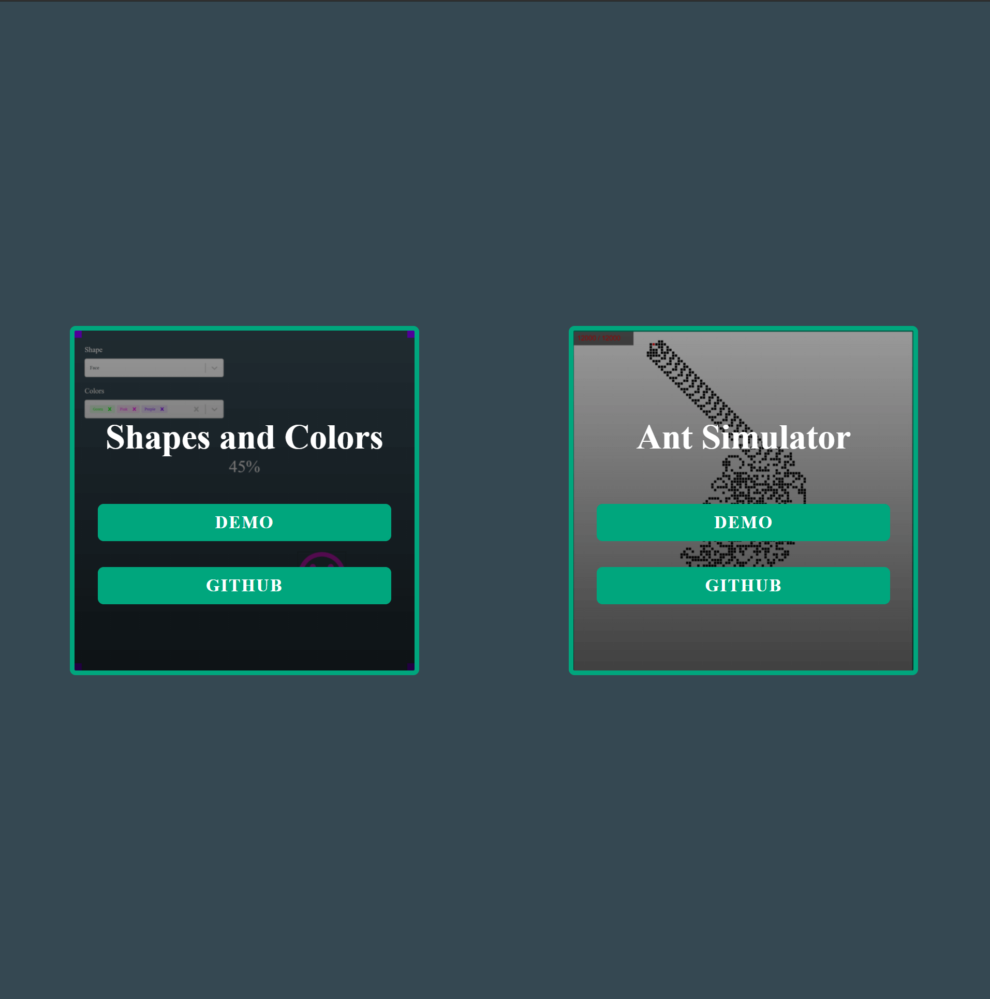
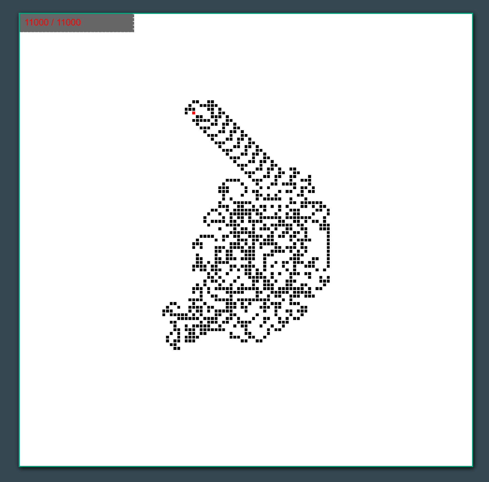
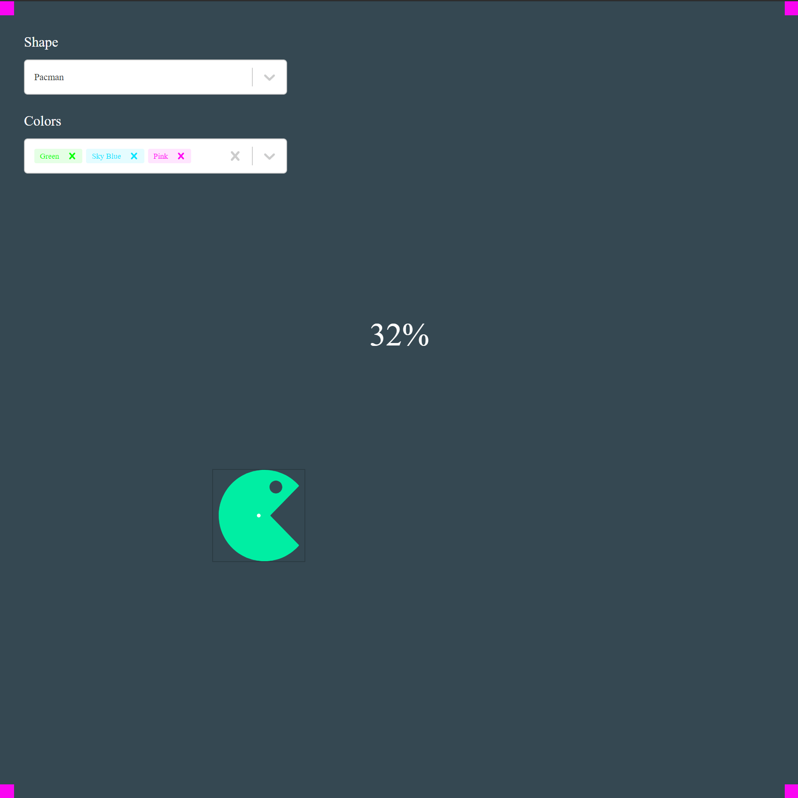
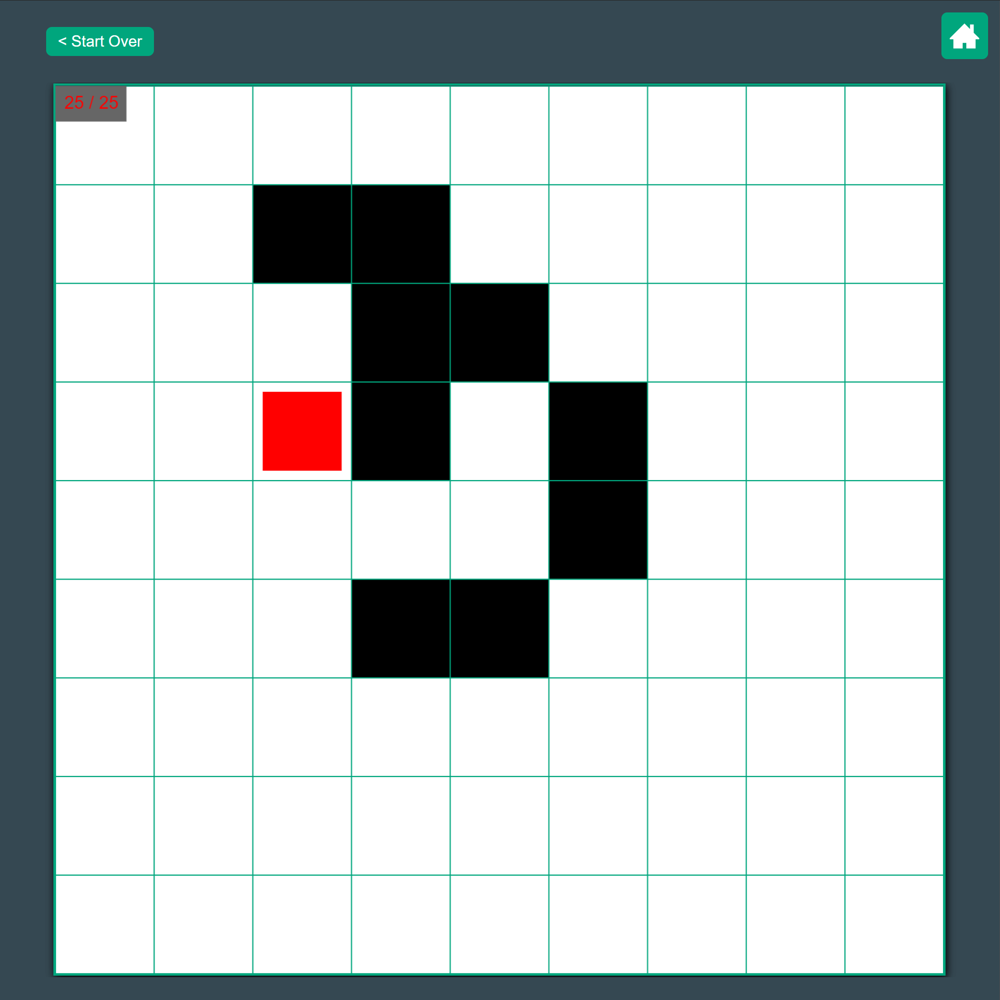

# Ant Simulator & Draggable Shapes

[Click this to see the site](https://simulation.pirated.technology/)

----

__PLEASE READ THIS PART:__

I've added a README within `/client` and `/server`.

Please go into those folders to read the notes I wrote for you.

Feel free to email any questions to: `develop.nathan@gmail.com`

----

<table>
  <tbody>
    <tr>
      <td></td>
      <td></td>
    </tr>
    <tr>
      <td></td>
      <td></td>
    </tr>
  </tbody>
</table>

----

__YOU DON'T NEED TO READ THIS PART:__

## The Prompt

### Question 1) Shapes
Create a web page using React to display a draggable shape in the middle of the screen.  The shape should change color as it moves from the center to the edge of the screen.
Allow user to choose the type of shape and a sequence of changing colors from a dropdown list. The list should be populated on page load via API call to a web service written in C#/.NET Core.

 
### Question 2) Ant
An ant is sitting on a grid of white and black squares.

Initially the grid is all white and the ant faces right. At each step it does the following:

- At a white square, flip the color of the square, turn 90 degrees right (clockwise), and move forward one unit.
- At a black square, flip the color of the square, turn 90 degrees left (counter-clockwise), and move forward one unit.

Write a program in C#/.NET Core to simulate the first K moves that the ant makes and display the grid at each move on a web page using React library.  The only input to the method is the number of moves K.
